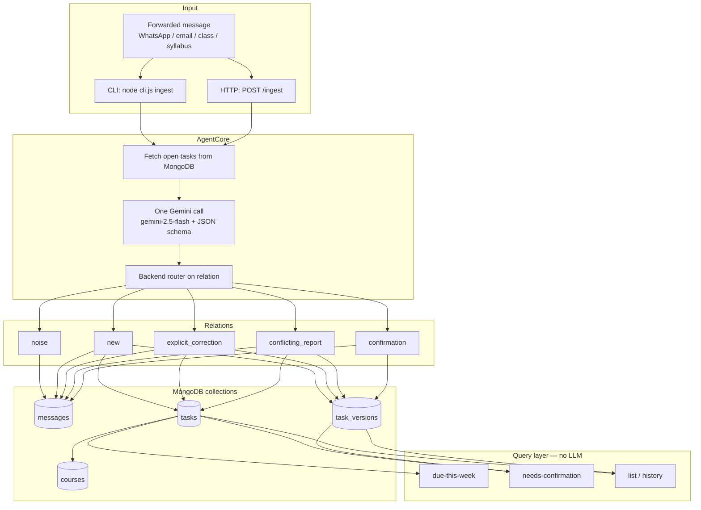
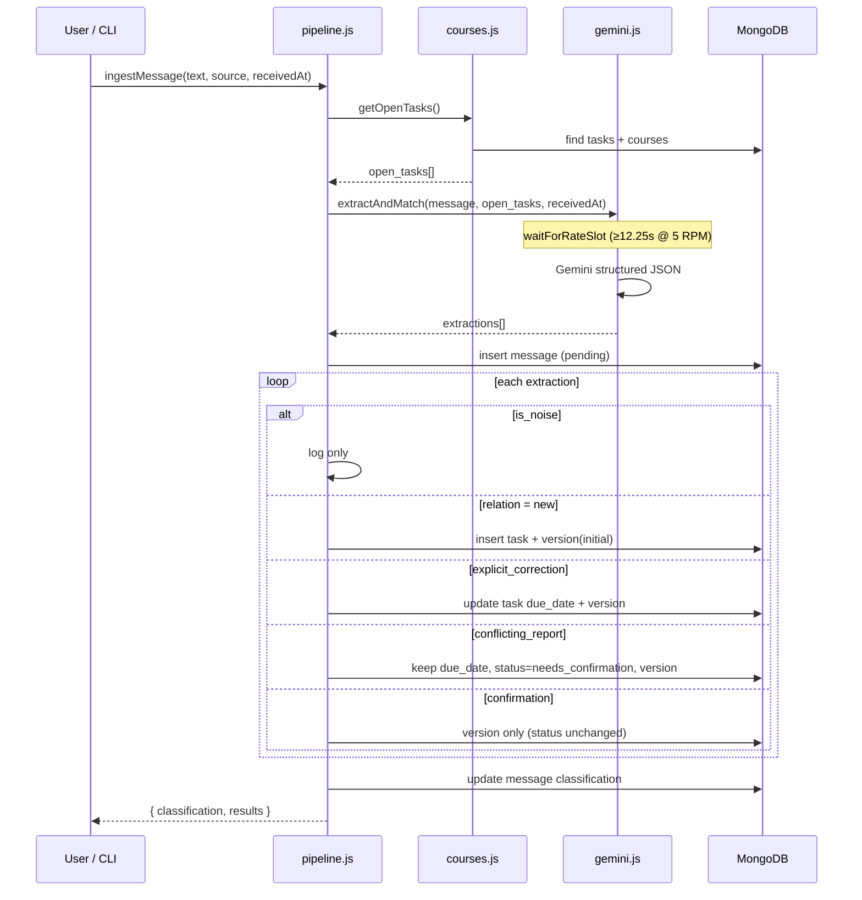
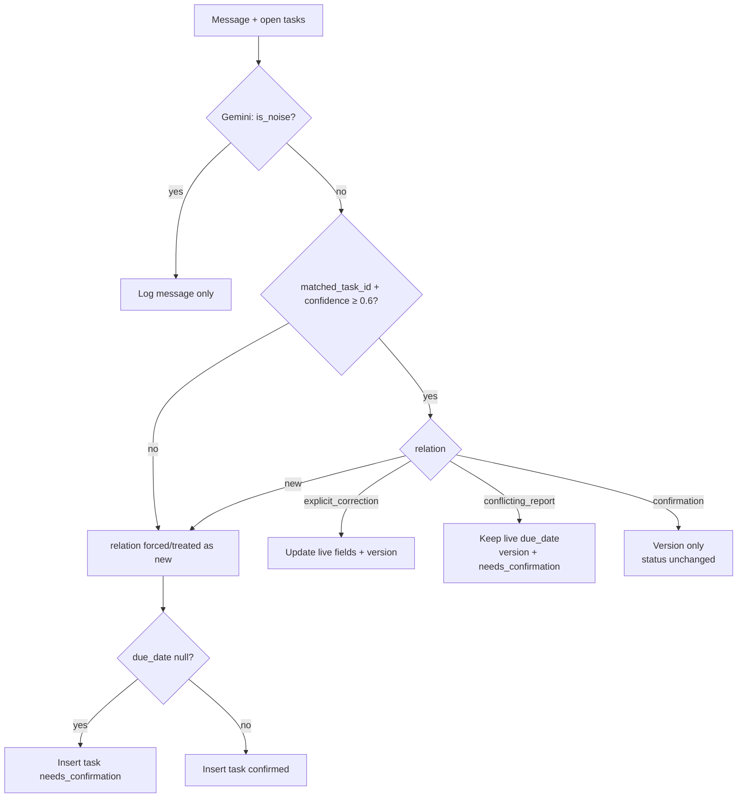

# Student Deadline Agent — Complete System Guide

This document explains the full system: problem, architecture, file structure, data model, AI + backend logic, every scenario with examples, how to test, and how the pieces connect.

---

## 1. Problem (what we solve)

Deadlines never arrive as one neat list. They show up scattered:

- Professor in class: *“quiz moved to Friday”*
- WhatsApp: *“DBMS report is due 25th not 28th”*
- Email: *“hackathon registration closes Sunday”*
- Friend: *“is the OS lab due this week or next?”*

Result: students miss high-weightage work because the information existed but was noisy, contradictory, and never centralized.

### Agent responsibilities

For each forwarded message, the agent must:

1. **Extract the task** — what, which course, due when, weightage. Skip pure noise.
2. **Handle updates, not duplicates** — *“due 25th not 28th”* corrects an existing task.
3. **Know when it doesn’t know** — unknown deadline or conflicting sources → save the task, mark `needs_confirmation`, keep both versions. Never silently guess.
4. **Answer questions from a real database** — *“what’s due this week?”* is plain MongoDB, not chat history or another LLM call.

---

## 2. High-level architecture



### Design principles

| Principle | How we implement it |
|-----------|---------------------|
| One model call per message | `extractAndMatch()` does extraction + match + relation in one structured JSON response |
| No vector DB | Open tasks are passed as plain JSON in the prompt |
| Backend does not re-judge | Pipeline only routes on `relation` / `is_noise` |
| Append-only audit | Every change writes a `task_versions` row before/with the live update |
| Reads are deterministic | Queries never call Gemini |

---

## 3. File structure

```
backend/
├── .env                      # PORT, DATABASE_URL, GEMINI_API_KEY (gitignored)
├── .env.example              # Template for required env vars
├── .gitignore
├── package.json
├── README.md                 # Quick start
├── cli.js                    # CLI entry (ingest, queries, corpus, reset)
├── server.js                 # Express HTTP API
├── scripts/
│   └── setup.js              # Seed canonical courses
├── src/
│   ├── db.js                 # Mongo client, indexes, ObjectId helpers
│   ├── courses.js            # Course seed/lookup + open-task context
│   ├── gemini.js             # System prompt, schema, rate limit, Gemini call
│   ├── pipeline.js           # Ingest + relation router (write path)
│   └── queries.js            # due-this-week / needs-confirmation / history (read path)
├── data/
│   └── test-messages.json    # 80 fake messages for corpus testing
└── docs/
    ├── deadline-agent-flow.md          # Reference design (v4)
    └── COMPLETE-SYSTEM-GUIDE.md        # This file
```

### What each module owns

| File | Responsibility |
|------|----------------|
| `cli.js` | Parse commands, print human-readable output, run corpus loop |
| `server.js` | Same ingest/query logic over HTTP JSON |
| `src/db.js` | Connect to Mongo (`deadline_agent` DB), ensure indexes |
| `src/courses.js` | Seed DBMS/OS/CN/SE/AI + aliases; resolve course; build open-task list for Gemini |
| `src/gemini.js` | Prompt + `responseSchema`; throttle (5 RPM); 429 backoff; return normalized extractions |
| `src/pipeline.js` | Persist message → call Gemini → `applyNew` / `applyCorrection` / `applyConflict` / `applyConfirmation` |
| `src/queries.js` | Pure Mongo reads; attach claimed dates for conflicts |
| `data/test-messages.json` | Ordered corpus with `text`, `source`, `received_at`, `tag` |

---

## 4. Data model (MongoDB)

Collections mirror the reference Postgres schema.

### `courses`

```js
{
  _id: ObjectId,
  name: "DBMS",                          // canonical
  aliases: ["Database Systems", "Db Mgmt Sys", ...],
  created_at: Date
}
```

Seeded defaults: **DBMS**, **OS**, **CN**, **SE**, **AI** (with aliases so “Db Mgmt Sys” maps to DBMS).

### `tasks` (live truth)

```js
{
  _id: ObjectId,
  course_id: ObjectId | null,
  title: "DBMS report",
  task_type: "assignment" | "quiz" | "exam" | "lab" | "registration" | "other",
  due_date: Date | null,                 // null = unknown deadline
  weightage: Number | null,              // e.g. 20 for 20%
  status: "confirmed" | "needs_confirmation",
  created_at: Date,
  updated_at: Date
}
```

### `task_versions` (append-only audit)

```js
{
  _id: ObjectId,
  task_id: ObjectId,
  due_date: Date | null,
  weightage: Number | null,
  source_message_id: ObjectId,
  reason: "initial" | "explicit_correction" | "conflicting_report" | "confirmation",
  date_resolution_note: String | null,   // e.g. how "next Friday" was resolved
  created_at: Date
}
```

### `messages`

```js
{
  _id: ObjectId,
  raw_text: String,
  source: "whatsapp" | "email" | "class" | "syllabus" | "api",
  received_at: Date,                     // anchor for relative dates
  classification: "noise" | "new_task" | "update" | "contradiction" | ...,
  matched_task_id: ObjectId | null,
  extractions: [ /* full Gemini objects */ ]
}
```

**Invariant:** `tasks.due_date` is never overwritten by a `conflicting_report`. Conflicts only append a version row and set `status = needs_confirmation`.

---

## 5. End-to-end message flow



### Step-by-step (code path)

1. **`ingestMessage`** (`pipeline.js`) loads open tasks.
2. **`extractAndMatch`** (`gemini.js`) waits for a rate-limit slot, calls `gemini-2.5-flash` once with:
   - system rules + few-shot examples
   - `received_at`, `source`, `message`, `open_tasks`
   - `responseMimeType: application/json` + `responseSchema`
3. Message row is inserted first so version rows can reference `source_message_id`.
4. Each extraction is routed by `applyExtraction`.
5. Message classification is finalized (`noise` / `new_task` / `update` / `contradiction`).
6. Later questions use **`queries.js` only** — no Gemini.

---

## 6. Gemini extraction contract

### Response shape (per message → array of extractions)

```json
{
  "extractions": [
    {
      "is_noise": false,
      "course": "DBMS",
      "title": "DBMS report",
      "task_type": "assignment",
      "due_date": "2026-08-28",
      "weightage": 20,
      "matched_task_id": null,
      "relation": "new",
      "confidence": 0.95,
      "reasoning": "...",
      "date_resolution_note": null
    }
  ]
}
```

### Relation meanings

| `relation` | When | Backend action |
|------------|------|----------------|
| *(noise)* `is_noise: true` | Social / venting / no deadline | Log message only |
| `new` | No confident match | Insert task; `needs_confirmation` if `due_date` null |
| `explicit_correction` | Override language (*“not 28th”*, *“moved to”*, *“cancelled”*) | Update live fields + version |
| `conflicting_report` | Different date/weight, **no** override words | Keep live date; version + `needs_confirmation` |
| `confirmation` | Restates stored value | Version only; **status unchanged** |

### Relative weekday rule (colloquial English)

Anchored on message `received_at`:

| Phrase | Meaning | Example from Mon 2026-08-24 |
|--------|---------|-------------------------------|
| `this Friday` / `Friday` | Nearest upcoming Friday | `2026-08-28` |
| `next Friday` | **Skip** nearest; Friday of the following week | `2026-09-04` |

`date_resolution_note` records how the phrase was resolved for auditability.

### Rate limiting

Free-tier `gemini-2.5-flash` ≈ **5 requests/minute**.

- Proactive spacing: ≥ `60000/RPM + 250ms` between calls (~12.25s at 5 RPM).
- On HTTP 429: parse `retryDelay` from the error and **actually sleep**, then retry (up to 5 attempts).
- No fake model fallback (only `gemini-2.5-flash`).

Env overrides: `GEMINI_MODEL`, `GEMINI_RPM`.

### Confidence guard

If `confidence < 0.6` and Gemini tried to match an existing task, the backend forces `relation = new` and clears `matched_task_id` — better an unconfirmed new row than a silent wrong merge.

---

## 7. Backend routing logic (detail)

### Noise

```
is_noise → classification: noise → no task / version write
```

### New task

```
insert tasks {
  status: due_date == null ? "needs_confirmation" : "confirmed"
}
insert task_versions { reason: "initial" }
```

### Explicit correction

```
update tasks.due_date / weightage / title...
if due_date cleared (cancelled): status = needs_confirmation
else: status = confirmed
insert task_versions { reason: "explicit_correction" }
```

### Conflicting report

```
DO NOT change tasks.due_date
set tasks.status = needs_confirmation
insert task_versions { reason: "conflicting_report", due_date: claimed }
```

### Confirmation

```
insert task_versions { reason: "confirmation" }
leave tasks.status as-is
  (does not clear an open conflict — that needs an explicit correction)
```

---

## 8. Scenario catalog (examples)

Each scenario shows: input → expected Gemini relation → DB outcome → how to test.

---

### 8.1 Noise

**Message**

> anyone up for football at 6?

**Expected**

```json
{ "is_noise": true, "relation": null }
```

**DB:** message logged with `classification: noise`. No `tasks` row.

**Test**

```bash
node cli.js ingest "anyone up for football at 6?" --source whatsapp
node cli.js list   # unchanged task count
```

Also treated as noise: sarcasm (*“assignment due tomorrow lol kill me”*), past reminiscing (*“quiz was yesterday”*), pure social chatter.

---

### 8.2 New task, deadline known

**Message** (email, `2026-08-20`)

> DBMS report submission on 28th August, worth 20% of grade

**Expected**

```json
{
  "is_noise": false,
  "course": "DBMS",
  "title": "DBMS report",
  "task_type": "assignment",
  "due_date": "2026-08-28",
  "weightage": 20,
  "relation": "new",
  "matched_task_id": null
}
```

**DB**

| Field | Value |
|-------|-------|
| status | `confirmed` |
| due_date | `2026-08-28` |
| version reason | `initial` |

**Test**

```bash
node cli.js ingest "DBMS report submission on 28th August, worth 20% of grade" \
  --source email --at 2026-08-20T11:00:00Z
node cli.js list
```

---

### 8.3 Explicit correction (update, not duplicate)

**Prior state:** DBMS report due `2026-08-28`.

**Message**

> DBMS report due 25th not 28th

**Expected**

```json
{
  "relation": "explicit_correction",
  "due_date": "2026-08-25",
  "matched_task_id": "<existing id>"
}
```

**DB**

- Same task `_id` (not a second task).
- Live `due_date` → `2026-08-25`.
- New version: `reason: explicit_correction`.
- Status stays `confirmed`.

**Test**

```bash
node cli.js ingest "DBMS report due 25th not 28th" --source whatsapp --at 2026-08-22T09:00:00Z
node cli.js list
# expect one DBMS row dated 2026-08-25
```

---

### 8.4 Unknown deadline

**Message**

> Hackathon registration closes soon, don't miss it

**Expected**

```json
{
  "relation": "new",
  "task_type": "registration",
  "due_date": null
}
```

**DB**

| Field | Value |
|-------|-------|
| due_date | `null` |
| status | `needs_confirmation` |

**Test**

```bash
node cli.js ingest "Hackathon registration closes soon, don't miss it"
node cli.js needs-confirmation
```

---

### 8.5 Contradiction walkthrough (the hard case)

**Setup** — task already exists:

| course | title | due_date | status |
|--------|-------|----------|--------|
| OS | Lab 3 | `2026-08-28` (Friday) | confirmed |

#### Message A — WhatsApp, Mon 2026-08-24 09:02

> OS lab due next Friday

Resolution: *next Friday* skips nearest Fri → **`2026-09-04`**.

Differs from stored `2026-08-28`, no override words → **`conflicting_report`**.

**Backend**

- Live `due_date` **stays** `2026-08-28`
- Version: `2026-09-04`, `conflicting_report`
- Status → `needs_confirmation`

#### Message B — email, Tue 2026-08-25 18:40

> OS lab submission deadline: this Friday

Resolution: *this Friday* → **`2026-08-28`** (matches live store) → **`confirmation`**.

**Backend**

- Version: `2026-08-28`, `confirmation`
- Status **remains** `needs_confirmation` (open conflict from A is not silently resolved)

**Final versions**

| due_date | reason |
|----------|--------|
| 2026-08-28 | initial |
| 2026-09-04 | conflicting_report |
| 2026-08-28 | confirmation |

**Test**

```bash
node cli.js reset
node cli.js ingest "OS Lab 3 is due Friday 28 August" --source class --at 2026-08-20T12:30:00Z
node cli.js ingest "OS lab due next Friday" --source whatsapp --at 2026-08-24T09:02:00Z
node cli.js ingest "OS lab submission deadline: this Friday" --source email --at 2026-08-25T18:40:00Z
node cli.js needs-confirmation
# claimed dates: 2026-08-28 vs 2026-09-04
```

---

### 8.6 Confirmation (same fact restated)

**Prior:** DBMS report due `2026-08-25`.

**Message**

> reminder — DBMS report due 25th

**Expected:** `relation: confirmation` → version only, no status change, no duplicate.

---

### 8.7 Course alias resolution

**Message**

> Db Mgmt Sys quiz next Monday

Maps to canonical course **DBMS** via `courses.aliases` (lookup in `findOrCreateCourse` / aliases shown in open-task context).

---

### 8.8 Ambiguous course / low confidence

**Message**

> assignment 2 due next week

If two “assignment 2” tasks exist (DBMS + OS) and confidence &lt; 0.6 → forced `relation: new` with `course: null`, `needs_confirmation` rather than guessing which task to update.

---

### 8.9 Cancelled / postponed indefinitely

**Message**

> OS lab cancelled, will be rescheduled

**Expected:** `explicit_correction`, `due_date: null` → clear live date, `needs_confirmation`.

---

### 8.10 Multiple tasks in one message

**Message**

> Reminder: DBMS report on the 25th, and CN assignment 2 is due 31st

Gemini returns **two** objects in `extractions[]`; pipeline runs the same router once per element.

---

### 8.11 Filling an unknown deadline later

1. Create hackathon with `due_date: null`.
2. Later: *“Hackathon registration closes Sunday 30 August”* → match + `explicit_correction` (or new-with-match path) supplies a real date.

---

## 9. Query layer (no LLM)

### What’s due this week?

```js
// queries.dueThisWeek()
tasks where due_date ∈ [today, today + 7 days]
```

```bash
node cli.js due-this-week
# GET /tasks/due-this-week
```

### What needs confirmation?

```js
tasks where status === "needs_confirmation"
+ distinct due_dates from task_versions  // both sides of a conflict
```

```bash
node cli.js needs-confirmation
# GET /tasks/needs-confirmation
```

### Full history for one task

```bash
node cli.js history <taskId>
# GET /tasks/:id/history
```

Returns live task + ordered versions with `reason`, `due_date`, `date_resolution_note`, source excerpt.

---

## 10. CLI & HTTP reference

### Environment

```bash
cp .env.example .env
# DATABASE_URL=mongodb+srv://...
# GEMINI_API_KEY=...
# optional: GEMINI_RPM=5
```

```bash
npm install
npm run setup
```

### CLI commands

| Command | Purpose |
|---------|---------|
| `node cli.js ingest "<text>" [--source TYPE] [--at ISO]` | Forward one message |
| `node cli.js due-this-week` | Query upcoming week |
| `node cli.js needs-confirmation` | Unconfirmed / conflicted tasks |
| `node cli.js list` | All tasks |
| `node cli.js history <id>` | Version audit trail |
| `node cli.js run-corpus` | Replay `data/test-messages.json` |
| `node cli.js reset` | Wipe messages/tasks/versions (keeps courses) |

### HTTP API (`npm run dev`)

| Method | Path | Body / notes |
|--------|------|----------------|
| GET | `/` | Endpoint index |
| POST | `/ingest` | `{ "text", "source?", "received_at?" }` |
| GET | `/tasks` | All tasks |
| GET | `/tasks/due-this-week` | Week query |
| GET | `/tasks/needs-confirmation` | Confirmation queue |
| GET | `/tasks/:id/history` | Audit trail |

---

## 11. Test formats

### 11.1 Manual demo script (screen recording)

```bash
npm run setup
node cli.js reset

# 1 Noise
node cli.js ingest "anyone up for football at 6?"

# 2 New + correction
node cli.js ingest "DBMS report submission on 28th August, worth 20%" \
  --source email --at 2026-08-20T11:00:00Z
node cli.js ingest "DBMS report due 25th not 28th" \
  --source whatsapp --at 2026-08-22T09:00:00Z
node cli.js list

# 3 Unknown deadline
node cli.js ingest "Hackathon registration closes soon, don't miss it"
node cli.js needs-confirmation

# 4 Contradiction (next vs this Friday)
node cli.js ingest "OS Lab 3 is due Friday 28 August" \
  --source class --at 2026-08-20T12:30:00Z
node cli.js ingest "OS lab due next Friday" \
  --source whatsapp --at 2026-08-24T09:02:00Z
node cli.js ingest "OS lab submission deadline: this Friday" \
  --source email --at 2026-08-25T18:40:00Z
node cli.js needs-confirmation

# 5 DB queries
node cli.js due-this-week
node cli.js list
```

### 11.2 Corpus format (`data/test-messages.json`)

80 messages. Each object:

```json
{
  "text": "OS lab due next Friday",
  "source": "whatsapp",
  "received_at": "2026-08-24T09:02:00Z",
  "tag": "contradiction_next_friday"
}
```

| Field | Role |
|-------|------|
| `text` | Raw forwarded content |
| `source` | Channel hint for Gemini |
| `received_at` | Anchor for relative dates (critical for Friday cases) |
| `tag` | Human label for why this message is in the set (not used by the agent) |

Tags include: `noise`, `new_known`, `explicit_correction`, `unknown_deadline`, `contradiction_next_friday`, `confirmation_this_friday`, `multi_task`, `ambiguous_course`, `cancelled`, etc.

**Run**

```bash
node cli.js reset
node cli.js run-corpus
```

At 5 RPM this takes ~16 minutes. You should see `⏳ rate limit: sleeping …` between calls — that is intentional.

### 11.3 Pass / fail checklist

| Scenario | Pass criteria |
|----------|----------------|
| Noise | Message logged; task count unchanged |
| New known deadline | One task; `confirmed`; version `initial` |
| Explicit correction | Same `_id`; date updated; no duplicate |
| Unknown deadline | Task exists; `due_date` null; `needs_confirmation` |
| Conflicting report | Live date unchanged; both dates in versions |
| Confirmation after conflict | Status still `needs_confirmation` |
| due-this-week | Results match Mongo filter only (no Gemini) |
| Rate limit | No burst of immediate 429 loops; real sleep |

### 11.4 Example ingest CLI output

```json
{
  "message_id": "...",
  "classification": "contradiction",
  "results": [
    {
      "extraction": {
        "relation": "conflicting_report",
        "due_date": "2026-09-04",
        "date_resolution_note": "resolved 'next Friday' ... → 2026-09-04",
        "confidence": 0.95
      },
      "action": "conflicting_report",
      "kept_due_date": "2026-08-28",
      "reported_due_date": "2026-09-04",
      "status": "needs_confirmation"
    }
  ]
}
```

---

## 12. Relation decision flowchart



---

## 13. Defending the design (interview notes)

1. **Why one Gemini call?** Extraction, matching, and contradiction detection share the same context; a second “dedup” service adds complexity without buying accuracy at one-student scale.
2. **Why no embeddings?** Dozens of open tasks fit in the prompt; UUID match is explainable.
3. **Why `task_versions`?** Corrections and conflicts both need history. Without append-only versions you either overwrite silently or lose the fact that a conflict existed.
4. **Why confirmation doesn’t clear conflicts?** “Most recent message wins” is a silent guess. Only an `explicit_correction` should resolve ambiguity.
5. **Why `received_at` on every ingest?** Relative phrases are meaningless without an anchor; the Friday trap depends on it.
6. **Why rate limiting lives in `gemini.js`?** Every path (CLI, corpus, HTTP) shares one throttle + 429 backoff.

---

## 14. Quick map: requirement → code

| Requirement | Code |
|-------------|------|
| Extract task | `src/gemini.js` schema + prompt |
| Update not duplicate | `applyCorrection` in `pipeline.js` |
| Unknown / conflict → needs confirmation | `applyNew` (null date), `applyConflict` |
| Never silently guess date | Prompt rule + conflict keeps live date |
| Answer from DB | `src/queries.js` |
| 50–100 test messages | `data/test-messages.json` (80) |
| Keys out of repo | `.env` + `.gitignore` |

---

*Generated for the student deadline agent backend. Companion quick start: [`README.md`](../README.md). Reference design: [`deadline-agent-flow.md`](./deadline-agent-flow.md).*
