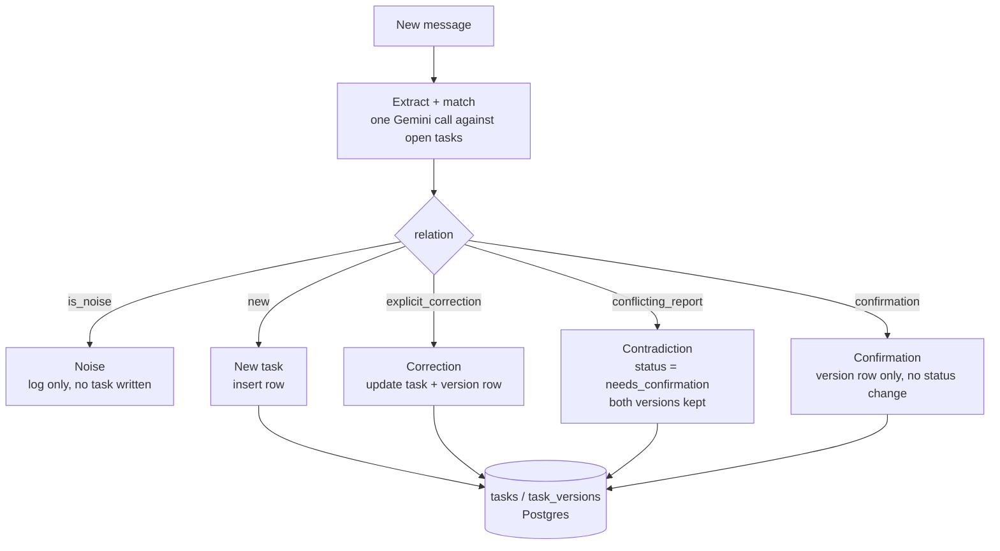

# Student deadline agent — flow

## 1. Overview

The agent ingests one forwarded message at a time (WhatsApp text, email, class
announcement, syllabus snippet). For each message it makes **one** structured
Gemini call that both extracts task fields *and* decides how the message
relates to what's already stored, then a thin backend layer executes that
decision against Postgres. There is no separate "dedup" pass and no vector
search — matching is done by giving the model the student's current open
tasks in-context.

Everything the student can later query (`what's due this week?`) is answered
from the database, never from chat history or from re-asking the model.

## 2. Data model

```sql
create table courses (
  id uuid primary key default gen_random_uuid(),
  name text not null,               -- canonical name, e.g. "DBMS"
  aliases text[] default '{}'       -- "Database Systems", "Db Mgmt Sys"
);

create table tasks (
  id uuid primary key default gen_random_uuid(),
  course_id uuid references courses(id),
  title text not null,              -- "Report submission", "Quiz 2"
  task_type text not null,          -- assignment | quiz | exam | lab | registration | other
  due_date date,                    -- nullable: unknown deadline is a valid state
  weightage numeric,                -- nullable, e.g. 20 for 20%
  status text not null default 'confirmed',  -- confirmed | needs_confirmation
  created_at timestamptz default now(),
  updated_at timestamptz default now()
);

create table task_versions (
  id uuid primary key default gen_random_uuid(),
  task_id uuid references tasks(id),
  due_date date,
  weightage numeric,
  source_message_id uuid references messages(id),
  reason text,       -- initial | explicit_correction | conflicting_report | confirmation
  created_at timestamptz default now()
);

create table messages (
  id uuid primary key default gen_random_uuid(),
  raw_text text not null,
  source text,               -- whatsapp | email | class | syllabus
  received_at timestamptz default now(),
  classification text,       -- noise | new_task | update | contradiction
  matched_task_id uuid references tasks(id)
);
```

`task_versions` is the audit trail. `tasks.due_date` / `tasks.weightage` are
only ever changed by the backend logic below, and every change is preceded by
a version row — so a contradiction can always be explained by reading the
version history for a task, and nothing is silently overwritten.

## 3. AI layer — Gemini

Use the Gemini API's native structured output (`responseMimeType:
"application/json"` + `responseSchema`) instead of a heavier agent framework.
This keeps the whole extraction step to one HTTP call you can point at and
defend line by line — no hidden framework logic deciding things for you.

- Model: `gemini-2.5-flash` (or `gemini-2.0-flash` if 2.5 isn't available on
  your key) — cheap and fast enough for single-message classification;
  quality is not the bottleneck here, the prompt and schema are.
- Key comes from `process.env.GEMINI_API_KEY`, never committed. `.env` is
  gitignored; README documents the one variable to set.
- SDK: `@google/genai` (Node/TS). One function, `extractAndMatch(message,
  openTasks)`, wraps the call and returns the parsed, schema-validated
  object — no manual JSON parsing / regex stripping needed since
  `responseSchema` guarantees shape.

Response schema (conceptually — expressed as a Gemini `responseSchema`):

```json
{
  "is_noise": "boolean",
  "course": "string | null",
  "title": "string | null",
  "task_type": "assignment | quiz | exam | lab | registration | other | null",
  "due_date": "string (ISO date) | null",
  "weightage": "number | null",
  "matched_task_id": "string (uuid) | null",
  "relation": "new | explicit_correction | conflicting_report | confirmation | null",
  "confidence": "number 0-1",
  "reasoning": "string"
}
```

The system prompt instructs the model explicitly: never invent a `due_date`
if the message doesn't state or clearly imply one; treat `matched_task_id`
as required whenever `relation` isn't `new`; and to output
`explicit_correction` only when the message itself contains override
language ("not X", "actually", "moved to", "correction:") — otherwise, if a
value conflicts with a task that already has a different stored value, use
`conflicting_report`. This one instruction is what separates 6.3 from 6.4
below, and it's worth over-specifying in the prompt with both examples
inline (few-shot), since it's the single easiest thing for a smaller/faster
model to get wrong.

## 4. Per-message pipeline

For every incoming message:

1. **Fetch context.** Pull the student's open tasks (recent N, optionally
   pre-filtered by a cheap keyword match on course name/alias) so Gemini has
   something to match against. Keep this list short — it's the main lever on
   both cost and match accuracy.
2. **One Gemini call, structured output** as described in §3.
3. **Backend executes the decision** — it does not re-judge anything, it
   just routes on `relation`:
   - **noise** → log the message, write nothing to `tasks`
   - **new** → insert a task row; `status = needs_confirmation` if
     `due_date` is null
   - **explicit_correction** → update `tasks.due_date` / `weightage` on the
     matched task, append a `task_versions` row with
     `reason = explicit_correction`, keep `status = confirmed`
   - **conflicting_report** → do **not** touch the live `tasks.due_date`;
     append the new value as a `task_versions` row and set
     `status = needs_confirmation` (see §6.4 for the full walkthrough)
   - **confirmation** → message just restates a value that's already
     stored → append a `task_versions` row (`reason = confirmation`), no
     status change

## 5. Flowchart



## 6. Query layer

Reads never touch the model — plain SQL against `tasks`:

```sql
-- "what's due this week?"
select t.title, c.name as course, t.due_date, t.weightage, t.status
from tasks t join courses c on c.id = t.course_id
where t.due_date between current_date and current_date + interval '7 days'
order by t.due_date;

-- "what needs confirmation?"
select t.*, c.name as course
from tasks t join courses c on c.id = t.course_id
where t.status = 'needs_confirmation';

-- full history for one task (for a "why is this unconfirmed?" view)
select * from task_versions where task_id = $1 order by created_at;
```

## 7. Worked examples

### 7.1 Noise
> "anyone up for football at 6?"

`is_noise = true`. Nothing extracted, nothing written to `tasks`. The message
row is logged with `classification = noise` for traceability, but that's it.

### 7.2 New task, deadline known
> "DBMS report submission on 28th, worth 20% of grade"

No matching open task found. `relation = new`, `course = DBMS`,
`due_date = <28th>`, `weightage = 20`. Insert into `tasks` with
`status = confirmed`, insert a `task_versions` row with `reason = initial`.

### 7.3 Explicit correction
> "DBMS report due 25th not 28th"

Matches the task from 7.2 (`matched_task_id` set). `relation =
explicit_correction` because of the override language "not 28th". Backend
updates `tasks.due_date = 25th`, appends a `task_versions` row with
`reason = explicit_correction`. Status stays `confirmed`.

### 7.4 Contradiction, elaborated (no override signal)

This is the case most people get wrong — either by silently taking the
newest message as truth, or by overwriting the field and losing the fact
that a conflict ever existed. Walking through it end to end:

**Setup.** Task already exists from an earlier message:

| id | course | title | due_date | status |
|---|---|---|---|---|
| `t1` | OS | Lab submission | `2026-08-28` (a Friday) | confirmed |

**Message A** — WhatsApp, Monday 08-24, 9:02am:
> "OS lab due next Friday"

Gemini resolves "next Friday" relative to the message's `received_at`
(08-24) → `2026-08-28`. This matches `t1.due_date` exactly, so
`relation = confirmation`. A `task_versions` row is appended
(`reason = confirmation`, `due_date = 2026-08-28`), status untouched.

**Message B** — email, Tuesday 08-25, 6:40pm:
> "OS lab submission deadline: this Friday"

Gemini resolves "this Friday" relative to *this* message's `received_at`
(08-25) → `2026-08-29`, one day later than message A's Friday. This is the
realistic trap: two people both said "Friday" in good faith, but relative
date phrases resolve differently depending on when each message was sent —
neither is lying, neither is correcting the other, they just don't know they
disagree. Because the message contains no override language ("not", "actually",
"correction"), Gemini returns `relation = conflicting_report`, not
`explicit_correction`, along with `reasoning: "message states a Friday date
that differs from the stored due_date, with no indication it is
correcting a prior value"`.

**Backend action:**
- `tasks.due_date` is **left at `2026-08-28`** — never overwritten by a
  conflicting_report.
- A new `task_versions` row is inserted: `due_date = 2026-08-29`,
  `source_message_id = <message B>`, `reason = conflicting_report`.
- `tasks.status` is set to `needs_confirmation`.

**Resulting state:**

| id | course | title | due_date | status |
|---|---|---|---|---|
| `t1` | OS | Lab submission | `2026-08-28` | needs_confirmation |

`task_versions` for `t1`:

| due_date | reason | source |
|---|---|---|
| `2026-08-28` | initial | message that created the task |
| `2026-08-28` | confirmation | message A |
| `2026-08-29` | conflicting_report | message B |

The "needs confirmation" query surfaces this task with both `2026-08-28` and
`2026-08-29` visible (join `tasks` to its latest `task_versions` rows), so
the student sees exactly the two claims and which sources made them, rather
than the agent silently picking one. The task only returns to `confirmed`
when a later message either explicitly corrects it ("confirmed: OS lab is
the 28th") or the professor's own announcement is treated as
higher-trust — for the take-home, resolving it via an explicit correction
message is enough; you don't need a source-trust ranking system to satisfy
the requirement.

### 7.5 Unknown deadline
> "Hackathon registration closes soon, don't miss it"

`relation = new`, `due_date = null` (the model is instructed to never invent
a date). Task is inserted with `status = needs_confirmation` immediately,
since there's no date to confirm against yet — it shows up in the "needs
confirmation" list until a later message supplies a real date, which then
comes in through the same `explicit_correction` / `new`-with-match path as
7.3.

## 8. Additional edge cases

These are worth including in your 50–100 test messages precisely because
they break naive implementations — each one exercises a different part of
the schema/logic above.

**8.1 Ambiguous course reference.** *"assignment 2 due next week"* with no
course named, and the student has two open "assignment 2" tasks (DBMS and
OS). Gemini can't confidently set `matched_task_id`. Treat low-confidence
matches (`confidence` below a threshold, e.g. 0.6) as `relation = new` with
`course = null` and `status = needs_confirmation`, rather than guessing
which of the two it means — a wrong silent match is worse than an
unconfirmed duplicate-looking entry, since the former corrupts an existing
task.

**8.2 Course alias resolution.** *"Db Mgmt Sys quiz next Monday"* should
resolve to the same `courses` row as "DBMS". Handled by the `courses.aliases`
array — do a lookup before the Gemini call (or let Gemini see the alias list
and return the canonical course name) so `course_id` stays consistent rather
than creating a duplicate course.

**8.3 Task cancelled/postponed indefinitely.** *"OS lab cancelled, will be
rescheduled"* — matches `t1`, but there's no new date to set.
`relation = explicit_correction`, `due_date = null`. Backend should clear
`tasks.due_date` and set `status = needs_confirmation` rather than leaving a
stale date that's now known to be wrong.

**8.4 Multiple tasks in one message.** *"Reminder: DBMS report on the 25th,
and OS lab is due Friday"* — two tasks in one message. Simplest robust
approach: have Gemini return an array of extraction objects per message
instead of a single object, and run the same routing logic per element. This
is a schema change (array instead of object), not a logic change.

**8.5 Same fact repeated verbatim.** *"reminder — DBMS report due 25th"*
sent again a day after 7.3 already set it. Matches `t1`, value equals the
stored value exactly → `relation = confirmation`. No status change, just a
version row — this prevents a message that agrees with the current state
from being mistaken for a new contradiction.

**8.6 Sarcasm / rhetorical, not a real deadline.** *"assignment due
tomorrow lol kill me"* — contains date language but is clearly noise/venting,
not an announcement. This is exactly why extraction and noise-classification
happen in the *same* call with full message context, rather than a
keyword-based date-regex pre-filter: a regex would flag this as a deadline;
the model reading the whole sentence should not.

**8.7 Past-tense / already-happened.** *"quiz was yesterday, that was
rough"* — a real task, but backward-looking, not an upcoming deadline to
track. Treat as noise (or, if `t` already exists, a confirmation that
doesn't change anything) — never insert a new task with a past due_date.

## 9. Why this design stays simple

- **One model call per message** does extraction, dedup-matching, and
  contradiction-detection together — there's no second "entity resolution"
  service to build or explain.
- **No vector DB.** At the scale of one student's task list, passing the
  open tasks as plain JSON in the prompt is both simpler and more explainable
  than embeddings + similarity search.
- **The database is the single source of truth for reads.** Query answers
  never re-invoke the model, so they're fast, cheap, and deterministic.
- **`task_versions` is append-only.** It's the one structural decision that
  makes both "explicit correction" and "contradiction" possible to implement
  correctly — everything else in the design follows from never allowing a
  field to be overwritten without a row explaining why.
